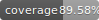

[](https://dl.circleci.com/status-badge/redirect/circleci/T2f6vNcw3F9zzqXE5jrhiN/PytwNkBbPHqVQDzhKKJPt4/tree/main)


# DRF Ecommerce API

A Django REST API for ecommerce with OpenID connect authentication, background notifications, and Kubernetes deployment.

## Features

-   Google OAuth2/OIDC authentication
-   Product catalog with hierarchical categories
-   Order management with stock tracking
-   SMS notifications via Africa's Talking
-   Email notifications to administrators
-   Background task processing with Celery
-   Comprehensive test coverage
-   Kubernetes deployment ready

## Tech Stack

-   Django 5.2 + Django REST Framework
-   PostgreSQL database
-   Redis for caching and task queue
-   Celery for background tasks
-   JWT authentication
-   Docker + Kubernetes

## Quick Start

1. Clone the repo and `cd` into it:

    ```bash
    git clone https://github.com/kimanikevin254/drf-ecommerce-api.git && cd drf-ecommerce-api
    ```

2. Create a virtual env, activate it, and install dependencies:

    ```bash
    python3 -m venv .venv
    source .venv/bin/activate
    pip install -r requirements.txt
    ```

3. Configure env vars:

    ```bash
    cp .env.example .env
    ```

    > Make sure to replace the placeholders in the `.env` file with your own credentials.

## API Documentation

See [API_DOCS.md](/docs/API_DOCS.md) for detailed endpoint documentation.
